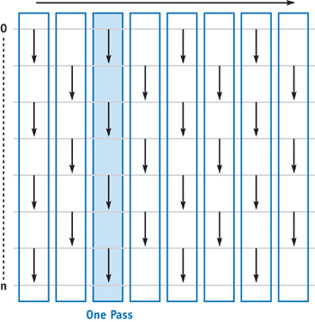

# gpgpu-odd-even-transition-sort
This is an implementation of the [odd-even transition sort](http.developer.nvidia.com/GPUGems2/gpugems2_chapter46.html) which is a parallel sorting algorithm. This implementation is made in GLSL using a 1D array as input which is placed into a 2D texture map, and another 2D texture map is used for the output buffer. The input and output buffer swaps roles after each pass.

  
(The data has to be internally independent to be used with this algorithm)

